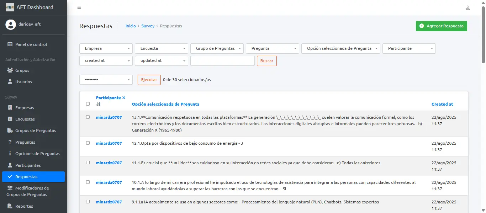
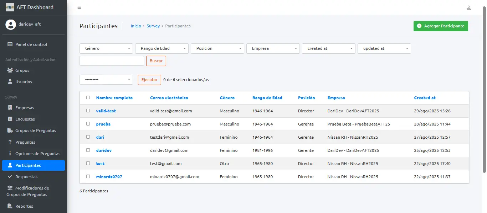
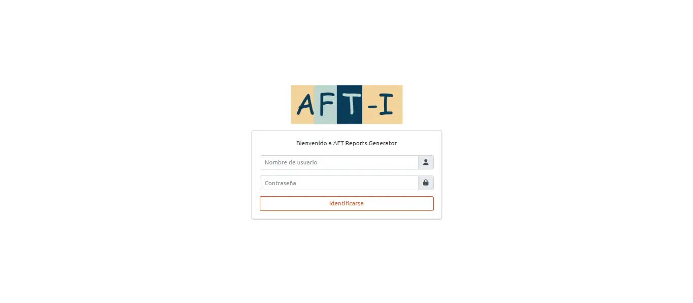
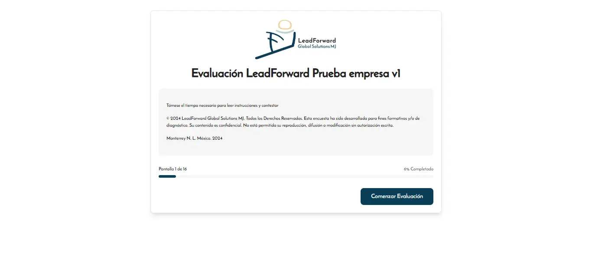
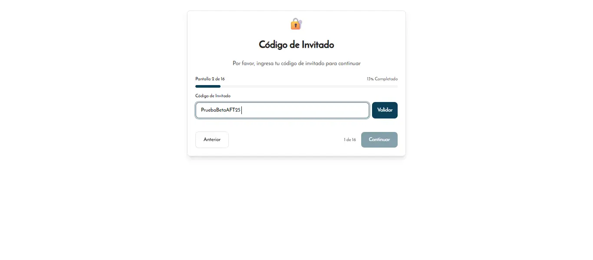
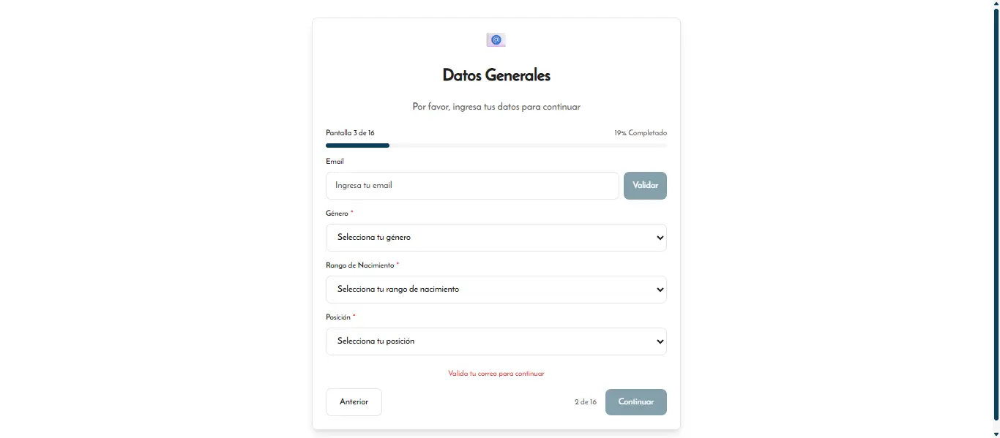
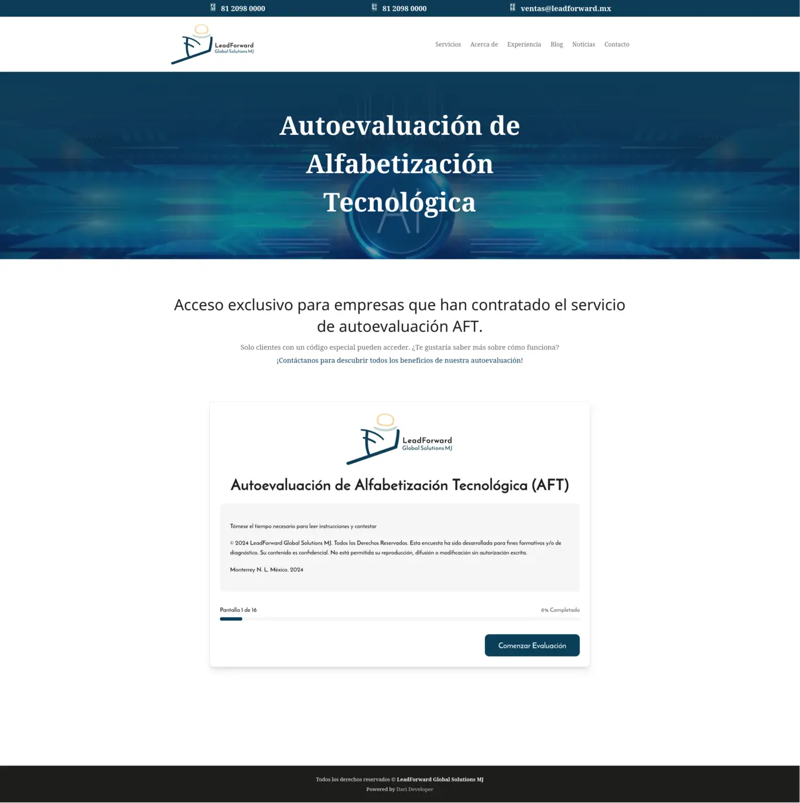
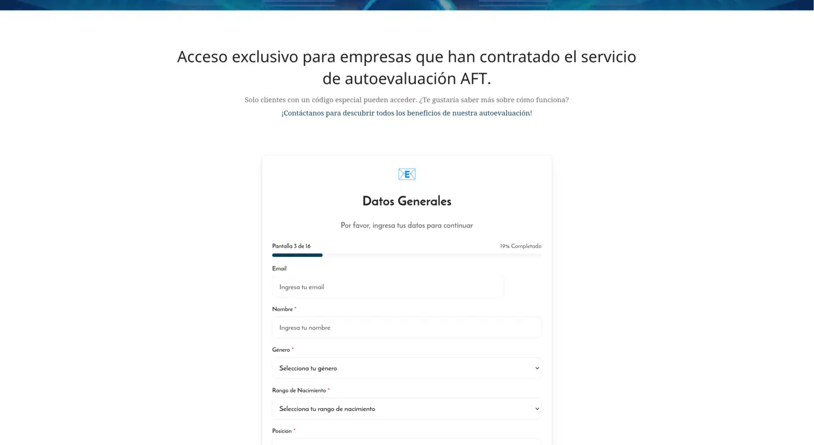

## Resumen Ejecutivo

**AFT** es una plataforma digital que ayuda a las organizaciones a evaluar cuánto saben de tecnología sus empleados. El sistema automatiza todo el proceso: desde que el participante recibe una invitación hasta que la empresa obtiene reportes detallados con resultados individuales y grupales, sin necesidad de intervención manual.

El proyecto fue desarrollado para **LeadForward Global Solutions**, consultora especializada en desarrollo de talento empresarial.

---

## El Cliente

**LeadForward Global Solutions** es una empresa mexicana con más de 25 años de experiencia en gestión de talento, liderazgo y desarrollo organizacional. Necesitaban una herramienta digital para medir las competencias tecnológicas de los empleados de sus clientes, reemplazando procesos manuales por un sistema automatizado que generara reportes profesionales sin esfuerzo adicional.

---

## La Solución

AFT cubre todo el ciclo de evaluación tecnológica con tres componentes que trabajan juntos de forma transparente para el usuario final.

### Para los participantes

- **Acceso sencillo:** Cada empleado recibe un código de invitación único. Solo necesita un navegador web — no hay que instalar nada.
- **Cuestionario guiado:** Un formulario paso a paso con preguntas de opción múltiple. Puede pausar y retomar después gracias al guardado automático de progreso.
- **Sin fricción:** El diseño se adapta a cualquier dispositivo (computadora, tablet, celular) y la experiencia visual refleja la marca de la empresa.
- **Disponible en vivo:** El formulario de evaluación puede verse en **[leadforward.mx/servicios/aft/v1](https://www.leadforward.mx/servicios/aft/v1/)**.

### Para los administradores

- **Panel de control completo:** Gestión de evaluaciones, participantes y empresas desde un solo lugar, con una interfaz moderna e intuitiva.
- **Reportes individuales automáticos:** Al finalizar cada evaluación, el sistema genera un PDF profesional con gráficos, puntuaciones y texto explicativo personalizado.
- **Reportes grupales:** Cuando se evalúa a todo un equipo o empresa, el sistema produce un informe consolidado con promedios, distribuciones, mapas de calor y recomendaciones estratégicas.
- **Eventos de registro:** Formularios públicos para capturar participantes, integrables directamente en sitios web existentes (WordPress, etc.), con protección antispam, confirmación por correo y botones para agregar el evento al calendario.
- **Exportación de datos:** Descarga de resultados en formatos estándar (CSV, Excel) para análisis adicionales.

### Para la toma de decisiones

- Los reportes clasifican a los participantes en tres niveles (Básico, Intermedio, Avanzado) para identificar rápidamente áreas de mejora.
- Las áreas con menor puntuación se resaltan automáticamente como acciones prioritarias.
- Se pueden establecer puntuaciones deseadas por empresa para comparar resultados contra objetivos específicos.

---

## Detalles Técnicos

### Dashboard Administrativo

El núcleo del sistema está construido con **Django 4.2** y **Django Rest Framework**, con **PostgreSQL** como base de datos.

- Motor de encuestas multigrupo con ponderaciones porcentuales, modificadores dinámicos y 6 categorías de resumen (CD, TN, CS, IP, TMA, EDC)
- 20 puestos estandarizados con mapeo de nivel de influencia, 11 departamentos, 4 cohortes generacionales
- Reportes individuales PDF con **ReportLab**: curvas de campana (matplotlib + scipy), texto dinámico por umbral de puntuación, comparativa contra promedios
- Reportes grupales PDF con **WeasyPrint**: mapa de calor con paginación dinámica, ranking nominal configurable, perfiles estratégicos, acciones prioritarias automáticas
- Sistema de eventos: formularios embedibles (X-Frame-Options exento), honeypot antispam, puerta de acceso con cuenta regresiva, integración Google/Outlook/Apple Calendar, notificaciones SMTP, exportación CSV y Excel
- Infraestructura: Amazon S3, n8n para generación asíncrona, Docker, Gunicorn, validación SMTP, 8 endpoints REST, 17 modelos admin, 11 comandos de gestión, pruebas con Selenium + Playwright + Locust

### Formulario de Evaluación

Aplicación web progresiva construida con **React 19 + Vite + SWC**, con estado global manejado por **Zustand**.

- 5 pantallas: bienvenida, código de invitación, datos generales (campos dinámicos desde API), preguntas (con modificadores grid/unique), finalización
- Persistencia de progreso con auto-guardado y restauración mediante SweetAlert2
- 6 integraciones API, 13 pruebas E2E con Playwright
- Tailwind CSS v4 con modo oscuro, tipografía ReemKufi y sistema de colores de marca

### Generador de Gráficas

Microservicio **Astro 5 + Node SSR** que genera gráficas de barras de resultados por competencia.

- Recibe datos vía URL desde el dashboard
- Escalado dinámico basado en rango real de datos, 13 colores de paleta corporativa
- Líneas de referencia en escala 1–10 y marcador de promedio por barra

**Repositorios:**
- Dashboard: [github.com/darideveloper/aft-reports-generator-dashboard](https://github.com/darideveloper/aft-reports-generator-dashboard)
- Formulario: [github.com/darideveloper/aft-reports-generator](https://github.com/darideveloper/aft-reports-generator)
- Gráficas: [github.com/darideveloper/aft-advanced-graph-generator](https://github.com/darideveloper/aft-advanced-graph-generator)

---

## Galería de Imágenes

  
  
  
  
  
  
  
  

---

## Resultados e Impacto

AFT permitió a LeadForward ofrecer a sus clientes un proceso de evaluación completamente digital y automatizado. Las organizaciones ahora pueden:

- **Ahorrar horas de trabajo manual** que antes requería la generación de reportes uno por uno.
- **Obtener resultados en minutos** en lugar de días o semanas.
- **Tomar decisiones informadas** sobre capacitación y desarrollo basadas en datos concretos.
- **Gestionar eventos y captar participantes** desde formularios embedidos en su propio sitio web.

---

## Proyectos Relacionados

- **[Lead Forward](/projects/leadforward)** — Sitio web corporativo de LeadForward Global Solutions, empresa para la cual fue desarrollado este ecosistema de evaluaciones.
