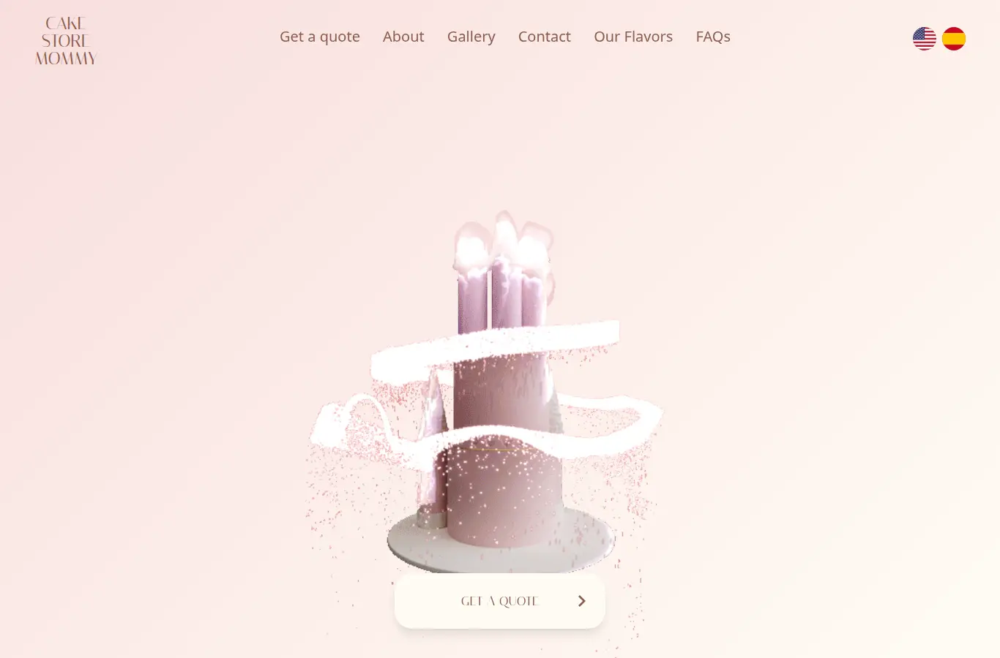
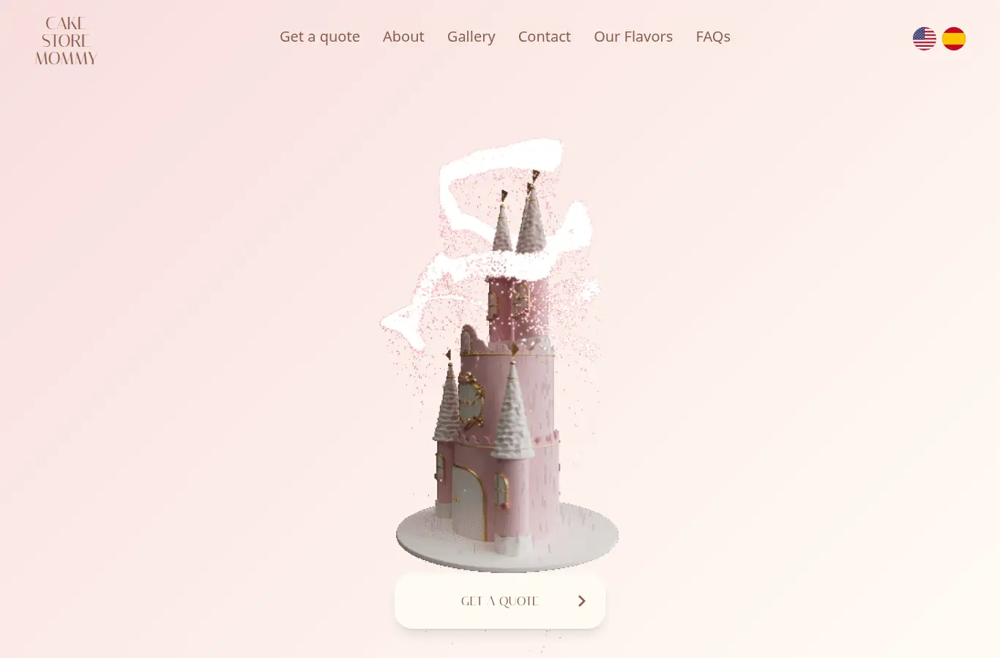
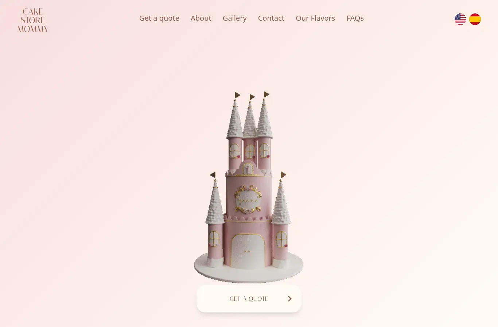
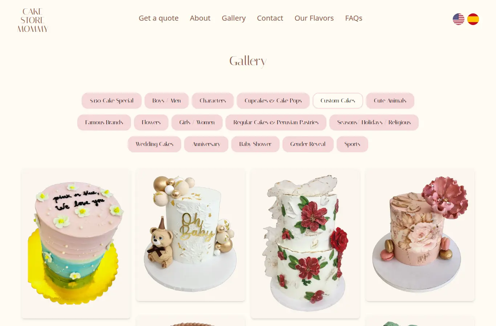
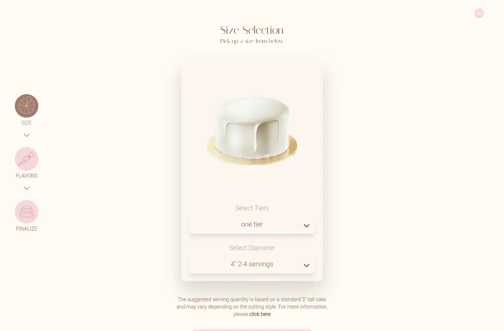

## Resumen Ejecutivo

**Cake Store Mommy** es un sitio web bilingüe (inglés y español) para una pastelería casera en Nueva Jersey especializada en pasteles personalizados y repostería peruana. El sitio permite a los clientes explorar el portafolio de trabajos, cotizar su pastel ideal paso a paso y enviar su pedido con fotos de referencia — todo desde el navegador, sin instalar nada. El negocio gestiona su galería y categorías desde un panel administrativo privado que alimenta el sitio en tiempo real.

El proyecto fue desarrollado para **The Cake Store Mommy, Inc.**, una pastelería hogareña con más de 14 años de experiencia.

---

## El Cliente

**The Cake Store Mommy, Inc.** es una pastelería casera ubicada en Nueva Jersey, Estados Unidos, especializada en pasteles personalizados para todo tipo de celebraciones, incluyendo pasteles temáticos, de personajes, de bodas y repostería peruana. Necesitaban una presencia digital profesional que reflejara la calidad de sus trabajos, atrajera clientes de habla inglesa y española, y simplificara el proceso de cotización y pedido sin depender de llamadas o mensajes uno a uno.

---

## La Solución

Cake Store Mommy combina una página de presentación visualmente atractiva con un cotizador interactivo que guía al cliente desde la elección del tamaño hasta el envío del pedido.

### Para los clientes

- **Sitio bilingüe:** Todo el contenido está disponible en inglés y español con un selector de idioma visible, alcanzando tanto a clientes locales como hispanohablantes.
- **Galera de trabajos en vivo:** Una galería con más de 500 imágenes organizadas por categorías (pasteles personalizados, personajes, bodas, pasteles de $150 y repostería peruana), con vista tipo mosaico y filtros por categoría.
- **Cotizador guiado paso a paso:** El cliente elige el número de pisos, el diámetro (porciones), el sabor del pastel, el relleno y el betún — cada opción con fotografía — y al final revisa su selección.
- **Pedido con fotos de referencia:** El formulario final permite subir hasta 3 imágenes de referencia, indicar tipo de entrega (recoger o envío), fecha y hora, así como detalles adicionales y presupuesto.
- **Confirmación clara:** Después de enviar el pedido, el cliente ve una página de agradecimiento con los pasos a seguir.

### Para los administradores

- **Panel de administración privado:** El negocio gestiona las imágenes de la galería, sus categorías y descripciones desde un panel exclusivo con vista previa de cada imagen.
- **Galería en tiempo real:** Los cambios hechos en el panel se reflejan automáticamente en el sitio público, sin intervención técnica.
- **Carga y optimización de imágenes:** Comandos que permiten cargar lotes de imágenes y calcular automáticamente sus dimensiones para una presentación óptima.
- **Categorías personalizables:** El negocio puede crear, renombrar y ordenar las categorías de su catálogo.

### Para la toma de decisiones

- **Analítica completa:** El sitio integra Google Analytics, Google Tag Manager, Meta Pixel y Umami, permitiendo medir tráfico, conversiones y el rendimiento de las campañas publicitarias.
- **Datos estructurados para SEO:** El sitio está optimizado para aparecer en búsquedas de Google con información de negocio local (horarios, teléfono, ubicación).

---

## Detalles Técnicos

### Landing Page y Cotizador

Aplicación web construida con **Next.js 14** (Pages Router) y **React 18**, desplegada en Vercel.

- Renderizado híbrido: la página principal usa SSR (`getServerSideProps`) para SEO, mientras que el cotizador y la página de agradecimiento usan SSG.
- Sistema de idiomas propio con React Context: todas las cadenas viven como arreglos `[en, es]` y el atributo `lang` del documento se sincroniza dinámicamente.
- Cotizador de 3 pasos: tamaño (1–4 pisos × diámetros/porciones), sabores (13 básicos + 9 premium, 11/13/11 rellenos, 7 betunes) y resumen final con formulario multipart que sube hasta 3 imágenes.
- Galería tipo mosaico (masonry) con carga perezosa, filtro por categoría consumiendo la API y lightbox de visualización.
- SEO avanzado: JSON-LD con schema `Bakery`, Open Graph, Twitter Cards, metadatos bilingües.
- Sliders con Splide, animaciones de scroll con AOS, fuentes de Google Fonts (Italiana, Roboto, Dancing Script), Tailwind CSS.

### Panel Administrativo y API

Backend construido con **Django 4.2** y **Django REST Framework**, con **PostgreSQL** como base de datos y **Amazon S3** para almacenamiento de imágenes, desplegado con Docker/Gunicorn.

- API REST de solo lectura con dos endpoints públicos internos: galería de imágenes (con filtro por categoría y paginación) y categorías, protegida con autenticación por token.
- Modelo `GalleryImage` que captura automáticamente el ancho y alto de cada imagen al guardarse (Pillow).
- Panel de administración personalizado con **django-jazzmin**: vista previa de imágenes en listas y formularios, filtros por categoría y fecha, búsqueda por descripción.
- Comandos de gestión: carga masiva de imágenes desde carpetas, recálculo de dimensiones y carga de categorías iniciales.
- Manejo de errores unificado con un formato de respuesta estándar.
- Infraestructura: Amazon S3, PostgreSQL, Docker, Gunicorn, CORS configurado, 10+ casos de prueba de API y pruebas de interfaz con Selenium.

**Sitios en vivo:**
- Landing page: [cakestoremommy.com](https://cakestoremommy.com)
- Panel administrativo: [cakestoremommy-dashboard.apps.darideveloper.com](https://cakestoremommy-dashboard.apps.darideveloper.com)

**Repositorios:**
- Landing page: [github.com/darideveloper/cakestoremommy](https://github.com/darideveloper/cakestoremommy)
- Panel: [github.com/darideveloper/cakestoremommy-dashboard](https://github.com/darideveloper/cakestoremommy-dashboard)

---

## Galería de Imágenes

  
  
  
  
  

---

## Resultados e Impacto

Cake Store Mommy le dio al negocio una vitrina profesional que muestra la calidad de su trabajo a una audiencia bilingüe. El cotizador interactivo agiliza el proceso de pedido al capturar toda la información necesaria — tamaño, sabores, fotos de referencia y datos de entrega — en un solo flujo, reduciendo los intercambios de mensajes. El panel administrativo permite al equipo actualizar el catálogo en tiempo real sin depender de un desarrollador, y la integración de analítica y SEO local facilita la medición del impacto de sus campañas publicitarias y la captación de nuevos clientes en la zona de Nueva Jersey.
