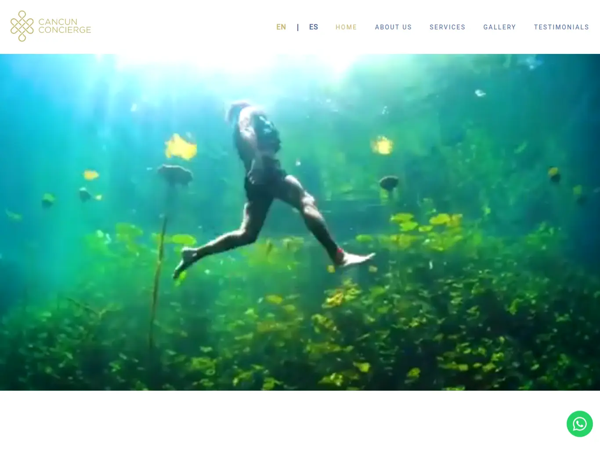
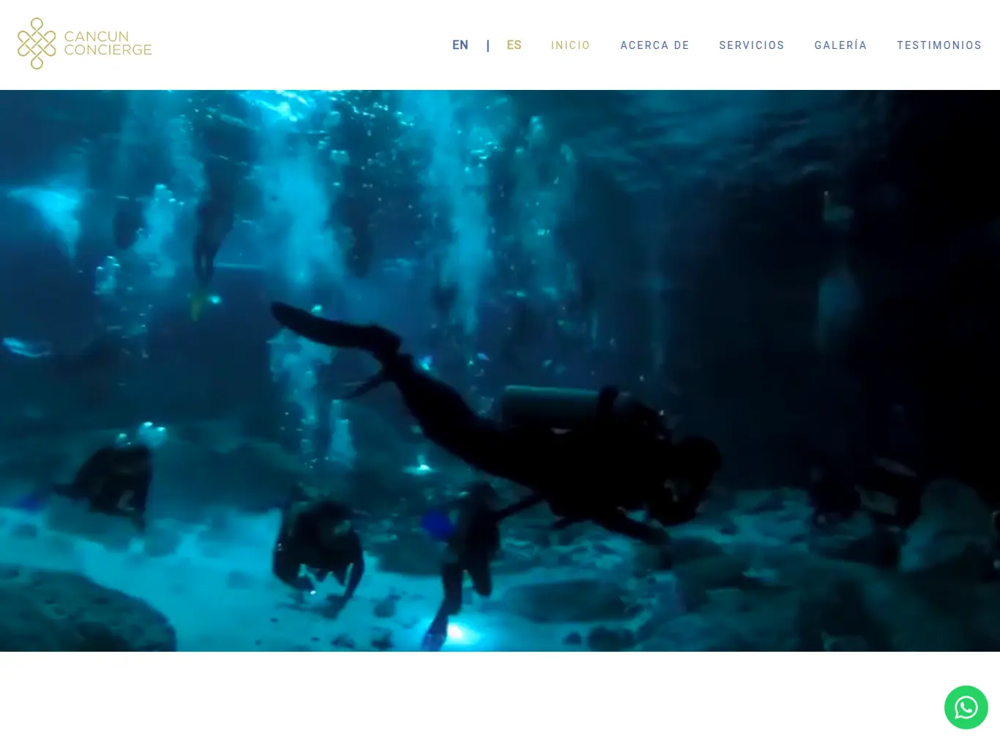
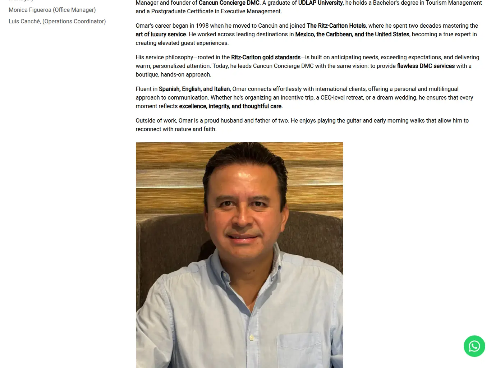
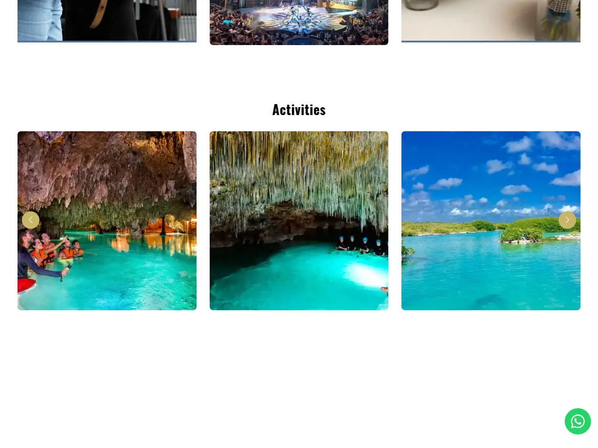
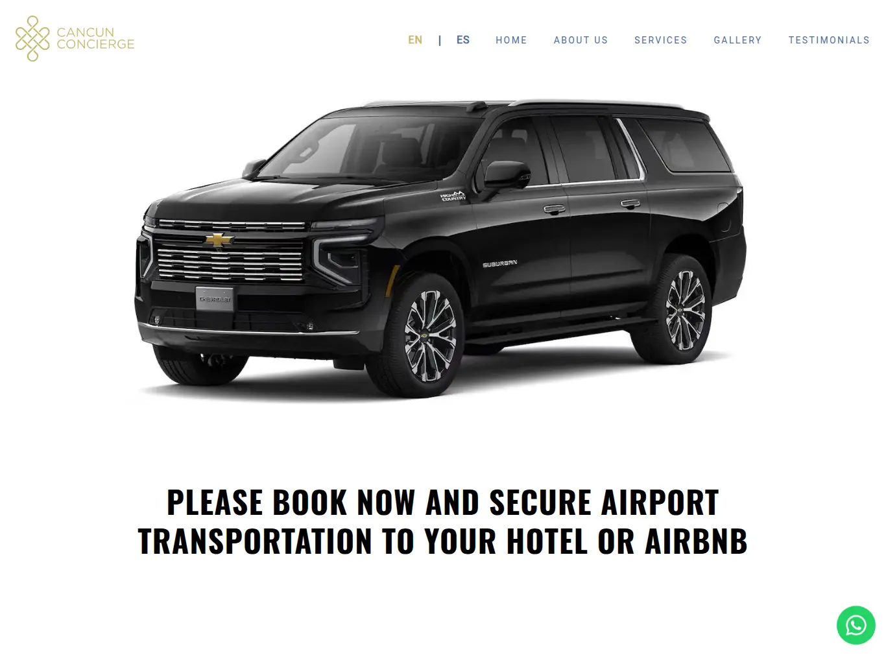
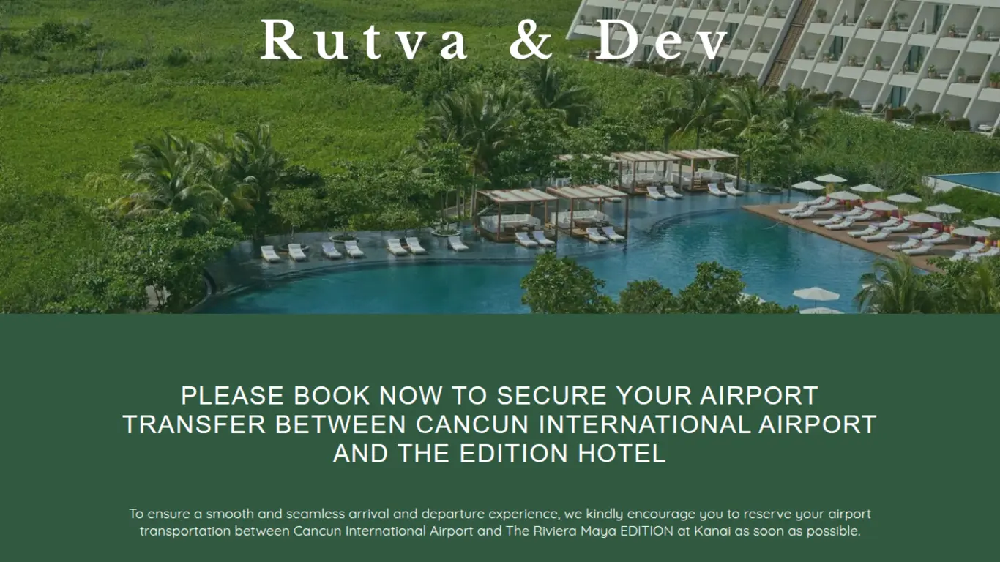
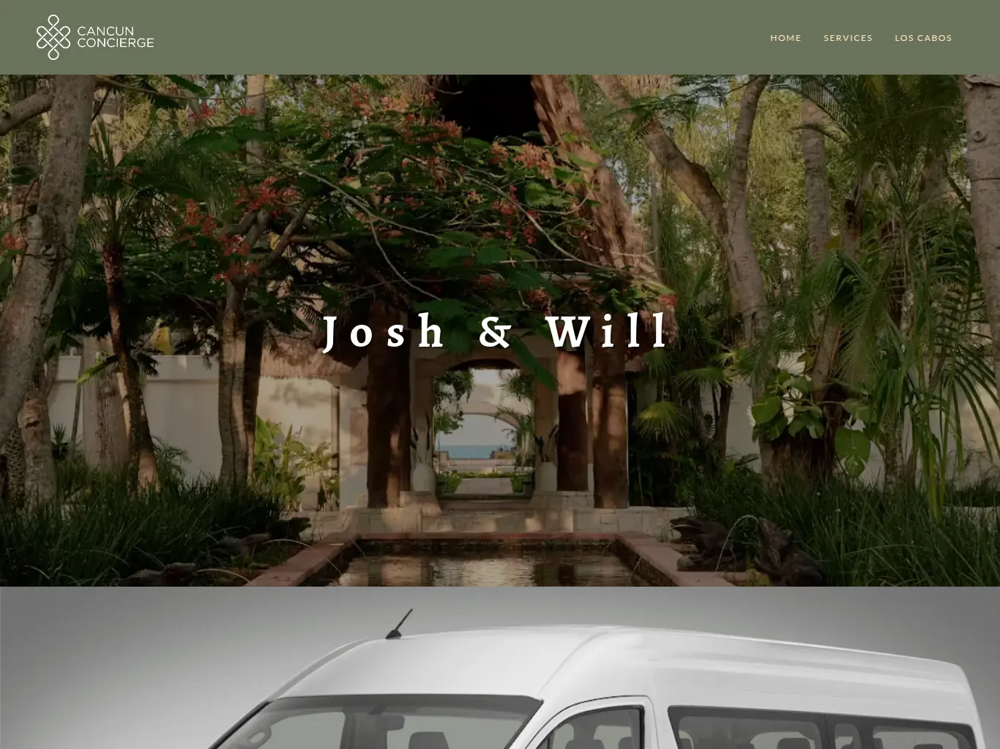
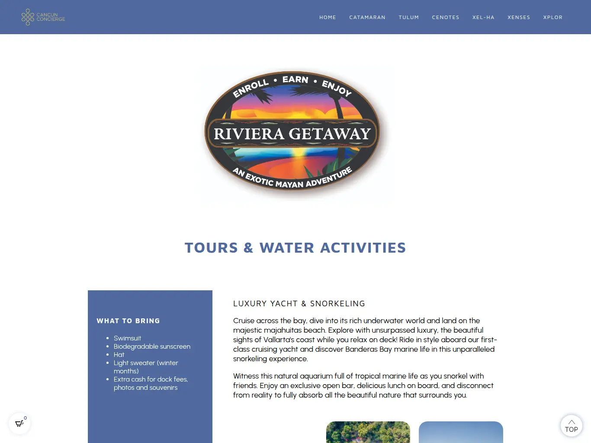

## Resumen Ejecutivo

Cancun Concierge DMC es una Destination Management Company boutique en Cancún que necesitaba digitalizar por completo la manera en que se promocionan y reservan sus servicios de lujo: traslados aeroportuarios, bodas, celebraciones y tours. Construimos un ecosistema integral compuesto por un sitio web bilingüe de alto rendimiento, un panel de administración central desde donde se gestionan todos los módulos de reserva, y más de 20 páginas de reserva personalizadas —una por cada evento, boda o cliente— con pagos por Stripe y confirmaciones por correo. El resultado es una operación de reservas automatizada, escalable y lista para crecer con cada nuevo evento que la compañía lanza.

---

## El Cliente

Cancun Concierge DMC es una empresa boutique de gestión de destinos fundada por un ex-profesional de Ritz-Carlton, con más de 20 años de experiencia operando en Cancún y la Riviera Maya. La compañía ofrece logística de traslados ejecutivos, experiencias VIP, gestión de eventos corporativos, bodas y servicios de concierge para viajeros de alto valor. Necesitaba una plataforma digital que proyectara lujo y confianza, y que al mismo tiempo le permitiera gestionar decenas de eventos simultáneos —cada uno con su propia página de reserva, precios, fechas y flujo de pago— sin depender de procesos manuales.

---

## La Solución

Se diseñó un ecosistema de tres capas: una vitrina web para proyectar la marca, un panel central para administrar todo, y páginas de reserva listas para usarse. Cada evento o boda recibe su propia página de reserva con la identidad visual del cliente, sus fechas, sus hoteles y sus precios, todo configurable desde el panel sin tocar código.

### Para los participantes (invitados y viajeros)

- **Página de reserva propia por evento:** cada boda, celebración o traslado tiene su URL única (por ejemplo `/rutva-dev-airport-transfers/` o `/loris-birthday-celebration/`) con la información clara del evento y del servicio.
- **Flujo de reserva guiado:** el huésped elige su tipo de traslado (llegada, salida o ambos), selecciona el vehículo, indica su hotel y captura los datos de vuelo en un formulario paso a paso.
- **Precios dinámicos e inteligentes:** el costo se calcula en tiempo real según vehículo, hotel y número de pasajeros; los eventos con transporte "de cortesía" ocultan los precios o los dejan en cero automáticamente.
- **Fechas de cortesía restringidas:** en bodas con transporte gratuito, solo se habilitan los días de llegada y salida principal del evento.
- **Pago por Stripe sin fricciones:** el pago se procesa con Stripe Checkout y el cliente recibe una confirmación por correo con los detalles de su servicio.
- **Códigos VIP:** algunos eventos permiten códigos de acceso que liberan el costo total del servicio para invitados especiales.
- **Contenido útil por página:** galerías de fotos, secciones de preguntas frecuentes (FAQ) y botón de WhatsApp para dudas inmediatas.

### Para los administradores

- **Panel de administración central (Django):** un solo lugar para gestionar todos los módulos de reserva: hoteles, tipos de transporte, precios, fechas disponibles y códigos VIP.
- **Alta de nuevos eventos rápida:** cada nuevo cliente o boda se agrega como un módulo independiente, reutilizando la infraestructura existente (traslados, bodas, tours y tienda).
- **Registro completo de ventas:** todas las reservas quedan almacenadas con sus datos de contacto, itinerario y estado de pago, consultables y filtrables.
- **Notificaciones automáticas por correo:** confirmaciones para el cliente y avisos para el equipo admin en cada reserva.
- **Widget embebible:** la tienda original se integra como widget dentro de WordPress para vender tours en sitios existentes.

### Para la toma de decisiones

- **Visibilidad total de la operación:** cada venta registrada está disponible en el panel con su valor, servicio y estado, permitiendo monitorear la actividad de todos los eventos en un solo lugar.
- **Escalabilidad probada:** la arquitectura está diseñada para que agregar un nuevo evento sea una tarea de horas, no de semanas, reduciendo el costo de lanzamiento de cada boda o experiencia.
- **Marca premium consistente:** el sitio bilingüe (inglés y español) con SEO técnico, datos estructurados y carga ultrarrápida posiciona a la empresa como socio de lujo ante clientes corporativos y viajeros de alto valor.

---

## Detalles Técnicos

### Sitio web principal (Astro + React)

Sitio estático bilingüe (inglés en `/`, español en `/es`) construido con Astro 5, React 19 y Tailwind CSS v4. Incluye sistema de internacionalización propio con 193 claves en inglés y 186 en español, animaciones AOS, carruseles Swiper, y un formulario de reserva de transporte con cálculo de precios en vivo y Stripe Checkout. SEO avanzado con meta tags localizados, hreflang, Open Graph, JSON-LD (LocalBusiness) y sitemap.

### Panel de administración (Django)

Aplicación Django 4.2 modular (monolito modular) con 12 apps, cada una representando un cliente, evento o vertical de negocio: tienda original de tours, Riviera Maya, bodas (Sarina & Abhi), Will Ryan, Rohan & Karisma, Driven Mastermind, Andrea Scott, Tony Thoa, Digital Realty, Seema Rohan, Rhea & Peeyush y Lori's Birthday. Usa Django Unfold para el admin moderno, integración con Stripe a través de un proxy externo, plantillas HTML de correos con vouchers por evento, y helpers compartidos para envío de correo y parseo de fechas.

### Páginas de reserva (React y Vanilla JS)

Dos generaciones de páginas de reserva:
- **6 en React** (Vite + Tailwind + Sass + SweetAlert2): loris-birthday-celebration, rhea-peeyush, sarina-abhi, seema-and-rohan, tony-thoa y will-ryan. Algunas con pagos Stripe, otras solo con captura de reserva y confirmación por correo.
- **~18 en HTML/Sass/JS vanilla** (proyecto `cancun-concierge`): páginas por evento como rutva-dev (con shuttle compartido y precios por persona), josh-will, dana-hirshal, digitalrealty, serena-gabriel, sunnyjoy-brett, kiana-swaroop, monica-vivek, ella-james, frini-chen, jessica-maxwell (con selector de aeropuertos CUN/TQO), rohan-karisma y sphere-rocket; además de páginas de tours con carrito de compras (riviera-getaway, service-master-restore, the-honey-pot, plumbing/waterworks-customers-activities).

Todas consumen los endpoints JSON del panel Django (hoteles, transportes, fechas libres) y procesan pagos mediante Stripe, con IDs de cuenta de Stripe por evento para atribuir correctamente cada pago.

**Repositorios:**
- Sitio principal: [github.com/darideveloper/cancunconciergedmc-v2](https://github.com/darideveloper/cancunconciergedmc-v2)
- Panel de administración: [github.com/darideveloper/ezbookingtours-store](https://github.com/darideveloper/ezbookingtours-store)
- Páginas React (ejemplos): [loris-birthday-celebration](https://github.com/darideveloper/loris-birthday-celebration), [rhea-peeyush-airport-transfers](https://github.com/darideveloper/rhea-peeyush-airport-transfers), [sarina-abhi-airport-transfers](https://github.com/darideveloper/sarina-abhi-airport-transfers), [seema-and-rohan-airport-transfers](https://github.com/darideveloper/seema-and-rohan-airport-transfers), [tony-thoa-airport-transfers](https://github.com/darideveloper/tony-thoa-airport-transfers), [will-ryan-airport-transfers](https://github.com/darideveloper/will-ryan-airport-transfers)
- Páginas vanilla y sitio anterior: [github.com/darideveloper/cancun-concierge](https://github.com/darideveloper/cancun-concierge)

**Sitio en vivo:**
- [cancunconciergedmc.com](https://cancunconciergedmc.com/) — sitio principal bilingüe
- [cancunconciergedmc.com/rutva-dev-airport-transfers/](https://cancunconciergedmc.com/rutva-dev-airport-transfers/) — ejemplo de página de reserva (shuttle compartido + privado)
- [cancunconciergedmc.com/josh-will-airport-transfers/](https://cancunconciergedmc.com/josh-will-airport-transfers/) — boda Josh & Will
- [cancunconciergedmc.com/loris-birthday-celebration/](https://cancunconciergedmc.com/loris-birthday-celebration/) — celebración de Lori (React)
- [cancunconciergedmc.com/rhea-peeyush-airport-transfers/](https://cancunconciergedmc.com/rhea-peeyush-airport-transfers/) — boda Rhea & Peeyush (React)
- [cancunconciergedmc.com/riviera-getaway/](https://cancunconciergedmc.com/riviera-getaway/) — tours con carrito de compras

---

## Galería de Imágenes

  
  
  
  
  
  
  
  ")
  ")
  

---

## Resultados e Impacto

El ecosistema convirtió la operación de reservas de Cancun Concierge DMC en un proceso digital, automatizado y escalable. Cada nueva boda o evento puede lanzarse con su propia página de reserva en cuestión de horas, con precios, fechas de cortesía y pagos Stripe configurados desde el panel central. Las más de 20 páginas de reserva en producción —combinando traslados aeroportuarios, bodas, celebraciones y tours— procesan reservas y pagos de forma autónoma, con confirmaciones por correo y visibilidad completa de todas las ventas en un solo panel. El sitio bilingüe con SEO técnico y diseño premium refuerza el posicionamiento de la marca como el socio de lujo de referencia en el Caribe Mexicano.
