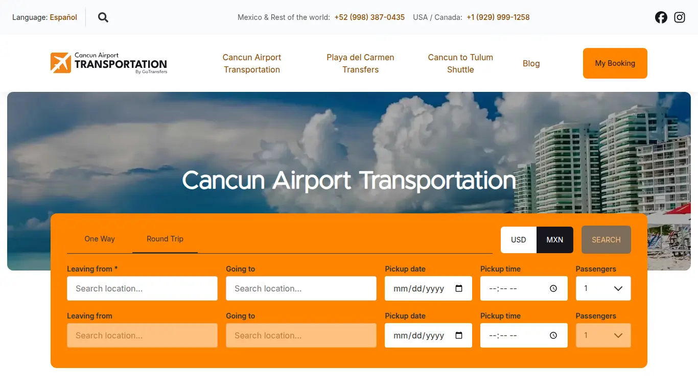
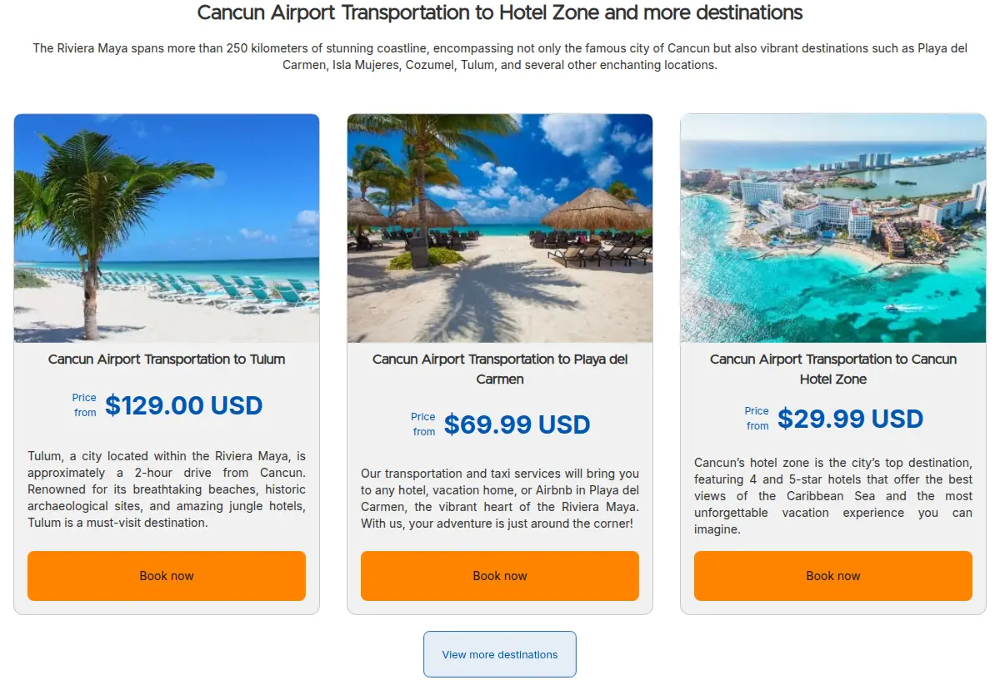
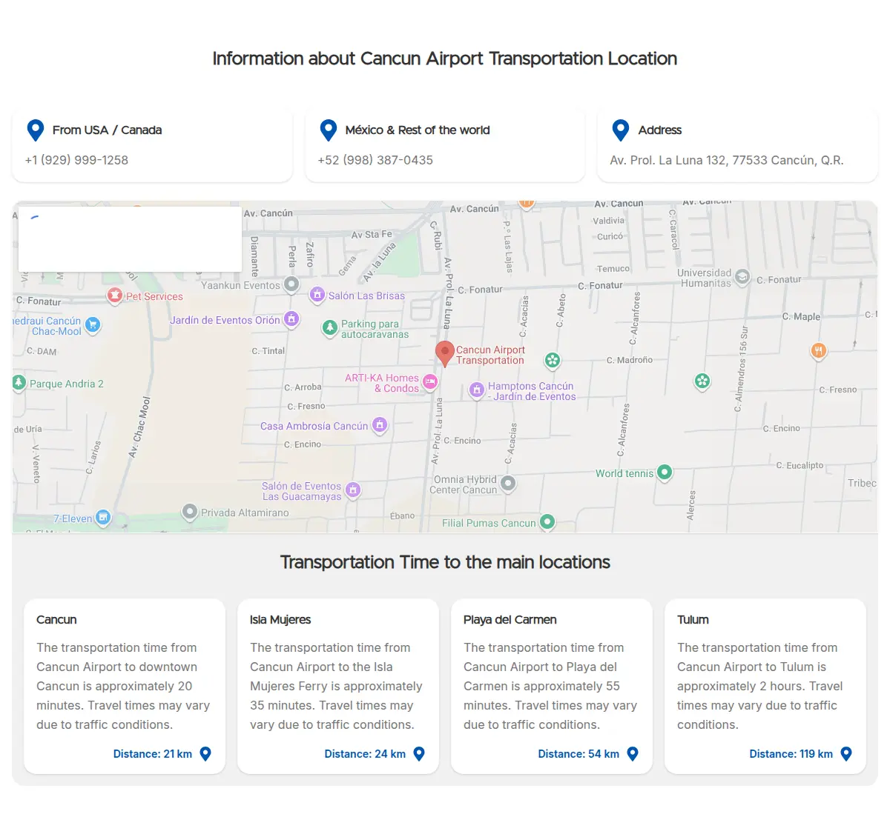
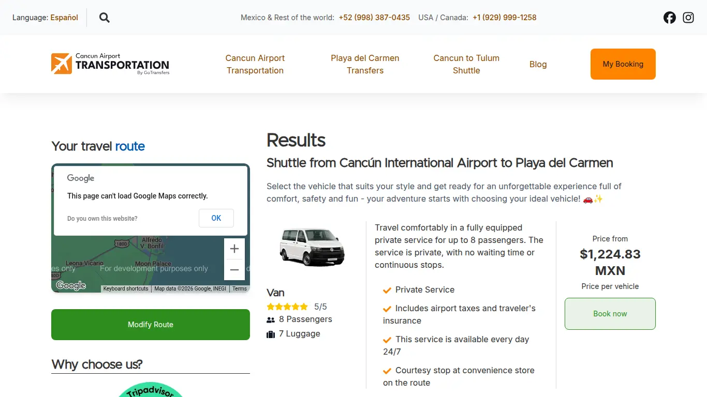
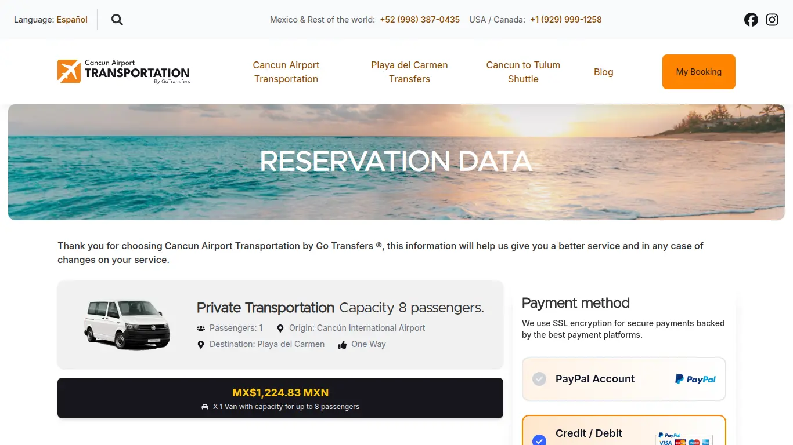
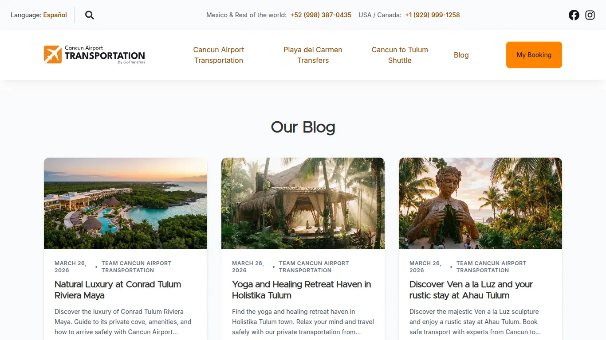
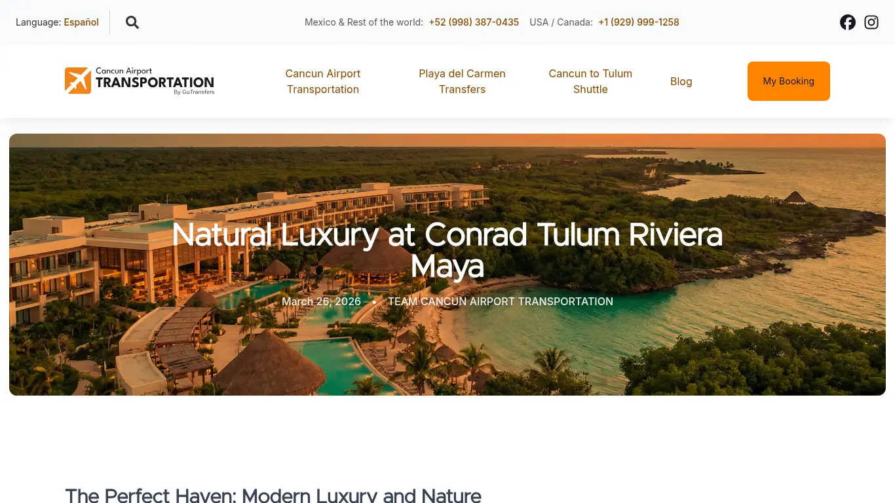
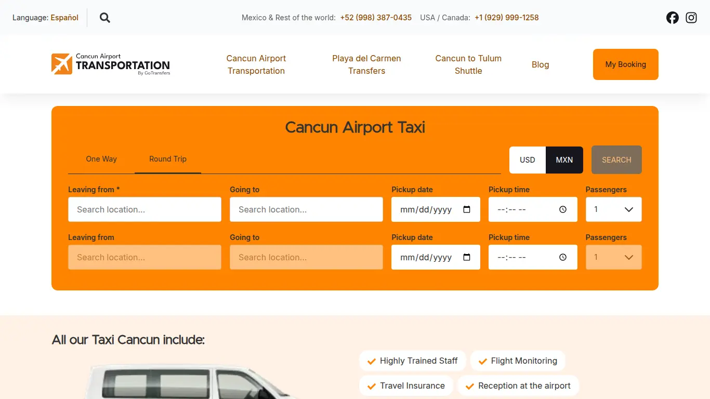

## Resumen Ejecutivo

Cancun Airport Transportation es una de las compañías de traslados aeroportuarios más reconocidas de Cancún, con más de 15 años de experiencia, 21,000+ clientes satisfechos y más de 21,000 traslados operados. Su sitio anterior estaba construido sobre una tecnología obsoleta que limitaba su posicionamiento en buscadores. Reconstruimos por completo su presencia digital con una landing page moderna y ultrarrápida en Astro que hoy alcanza un **SEO superior al 90%**, integrada con el motor de reservas que ya operaba la empresa: cotización en tiempo real, pago en línea con PayPal y tarjetas, consulta de reservas y un blog de contenido turístico que atrae visitantes de forma constante. Todo se administra desde un panel central que además actúa como intermediario seguro del backend heredado, ocultando credenciales y centralizando las llamadas a la API.

---

## El Cliente

Cancun Airport Transportation (marca "Cancun Airport Transportation by Go", anteriormente conocida como Caribbean Transfers) es una empresa mexicana de transporte privado y compartido con más de una década de trayectoria operando traslados desde el Aeropuerto Internacional de Cancún (CUN) hacia la zona hotelera, Playa del Carmen, Tulum, Akumal, Mérida y toda la Riviera Maya. Atiende tanto a viajeros de habla inglesa como hispana y necesitaba una plataforma que reflejara su confiabilidad, mejorara su presencia en buscadores y agilizara el proceso de reserva para no perder ventas frente a competidores mejor posicionados.

---

## La Solución

Se construyó un ecosistema de dos capas: una landing page bilingüe de alto rendimiento pensada para convertir visitantes en reservas, y un panel central que administra el contenido del blog y actúa como puente seguro hacia el sistema de reservas que la empresa ya usaba. El resultado es una operación digital completa que funciona en inglés y español, con una sola base de código y sin exponer la infraestructura interna.

### Para los viajeros

- **Reserva en pocos pasos:** el buscador de la portada permite elegir trayecto de ida o ida y vuelta, origen y destino con autocompletado por Google Maps, fecha, hora y número de pasajeros; al buscar se muestran al instante los vehículos disponibles con precio.
- **Cotización en tiempo real:** al seleccionar destino y fecha, el sistema consulta el motor de reservas y muestra tarifas actualizadas en dólares o pesos, con tres categorías de servicio: transporte privado, transporte de lujo y transporte para grupos.
- **Pago seguro en línea:** el proceso de registro guía al viajero por sus datos de vuelo, información de pasajeros y elección de pago con PayPal o tarjeta de crédito, con confirmación inmediata.
- **Consulta de reservas:** el viajero puede consultar el estado de su reserva en cualquier momento ingresando su código y correo.
- **Información útil y contenido:** páginas dedicadas por destino (Tulum, Playa del Carmen, Akumal, Mérida), por tipo de servicio (taxi, privado, lujo, grupos), tabla de tarifas, preguntas frecuentes y un blog con artículos sobre hoteles y destinos que posiciona a la empresa como autoridad en la región.

### Para los administradores

- **Panel de administración moderno:** el personal gestiona todo desde un panel con una interfaz actualizada y sencilla de usar.
- **Publicación de blog sin tocar código:** los artículos se escriben en formato Markdown con editor enriquecido, se les asigna idioma (inglés o español), palabras clave y un artículo relacionado; las imágenes se suben con un botón que copia la URL lista para usar.
- **Versión en inglés y español por artículo:** cada publicación puede tener su versión traducida, que el sitio enlaza automáticamente para el SEO internacional.
- **Intermediario seguro del sistema heredado:** el panel centraliza todas las llamadas al antiguo backend de reservas —cotización, creación de reservas, pagos y consultas— ocultando las credenciales y claves de acceso del cliente en el servidor, nunca en el navegador.

### Para la toma de decisiones

- **SEO superior al 90%:** la reconstrucción en Astro elevó el posicionamiento del sitio frente a su versión anterior, con datos estructurados, sitemaps, traducciones con hreflang y velocidad de carga optimizada.
- **Analítica de conversión:** se implementó seguimiento de conversiones de compra (GA4) para medir con precisión cuántas reservas genera el sitio.
- **Visibilidad de toda la operación:** todas las reservas y su estado quedan registradas en el panel, permitiendo monitorear la actividad comercial en un solo lugar.
- **Infraestructura moderna y escalable:** al desacoplar el sitio del sistema de reservas antiguo se redujo el riesgo de fallas y se facilita la evolución futura de cada componente de forma independiente.

---

## Detalles Técnicos

### Landing page (Astro + React)

Sitio estático bilingüe (inglés en `/`, español en `/es`) construido con Astro 5, React 19 y Tailwind CSS v4, con un solo router dinámico que genera 19 tipos de página por idioma a partir de archivos de traducción. Incluye:

- Motor de reservas con Zustand y persistencia en `localStorage` (el proceso sobrevive recargas), autocompletado de ubicaciones con Google Maps a través del panel, cálculo de tarifas en vivo y cambio de moneda USD/MXN.
- Pagos con PayPal Smart Buttons (recarga dinámica por moneda) y tarjeta de crédito, con captura de la orden y página de confirmación que dispara el evento de conversión de GA4.
- SEO técnico: JSON-LD dinámico (LocalBusiness, TouristDestination, Service, BlogPosting, Reviews, Product), canonical y hreflang por idioma, sitemap, robots.txt, feed RSS, índice de búsqueda del sitio y redirecciones heredadas `/en/*`.
- Rendimiento: imágenes AVIF/WebP optimizadas, precarga de fuentes e imágenes clave, `inlineStylesheets`, gzip y cabeceras de caché inmutables para estáticos.

### Panel central (Django)

Aplicación Django 5.2 con dos responsabilidades:

- **CRM de blog:** modelos `Post` e `Image`, API REST de solo lectura (`/api/posts/`) que sirve los artículos al sitio, con filtro por idioma vía cabecera `Accept-Language`, artículos relacionados y modo Markdown con editor SimpleMDE en el admin.
- **Intermediario del sistema heredado (`legacy_middleware`):** se conecta al antiguo backend de Caribbean Transfers (`api.caribbean-transfers.com`) mediante OAuth con tokens gestionados en caché y auto-renovación, y expone cinco endpoints públicos (`quote`, `create`, `capture`, `my-booking`, `autocomplete`) que traducen campos, inyectan configuración (`rate_group`, `site_id`), generan enlaces de pago y validan respuestas antes de entregarlas al frontend, ocultando siempre credenciales.

**Repositorios:**
- Landing page: [github.com/darideveloper/cancunsairporttransportation](https://github.com/darideveloper/cancunsairporttransportation)
- Panel central: [github.com/darideveloper/cancuns-airport-transportation-dashboard](https://github.com/darideveloper/cancuns-airport-transportation-dashboard)

**Sitio en vivo:**
- [cancunsairporttransportation.com](https://cancunsairporttransportation.com) — sitio principal bilingüe
- [cancunsairporttransportation.com/blog](https://cancunsairporttransportation.com/blog) — blog (inglés)
- [cancunsairporttransportation.com/es/blog](https://cancunsairporttransportation.com/es/blog) — blog (español)

---

## Galería de Imágenes

  
  
  
  
  
  
  
  

---

## Resultados e Impacto

La reconstrucción en Astro elevó el posicionamiento orgánico del sitio a un **SEO superior al 90%**, muy por encima de la versión anterior, atrayendo más visitantes en búsquedas de alto valor como "traslados del aeropuerto de Cancún". El flujo de reserva digital —cotización en tiempo real, pago en línea y consulta de reservas— transformó la operación en un proceso automatizado disponible 24/7 en inglés y español, mientras que el panel central permite publicar contenido de forma constante sin depender de desarrolladores. La separación del sitio del sistema de reservas heredado, mediante un intermediario seguro, protegió la infraestructura existente y sentó las bases para seguir escalando sin fricción.

---

## Proyectos Relacionados

- **[Cun Airport Shuttle](https://cunairportshuttle.com)** — segunda marca del mismo cliente, un clon de la página principal con textos adaptados que comparte el mismo panel Django y motor de reservas.
